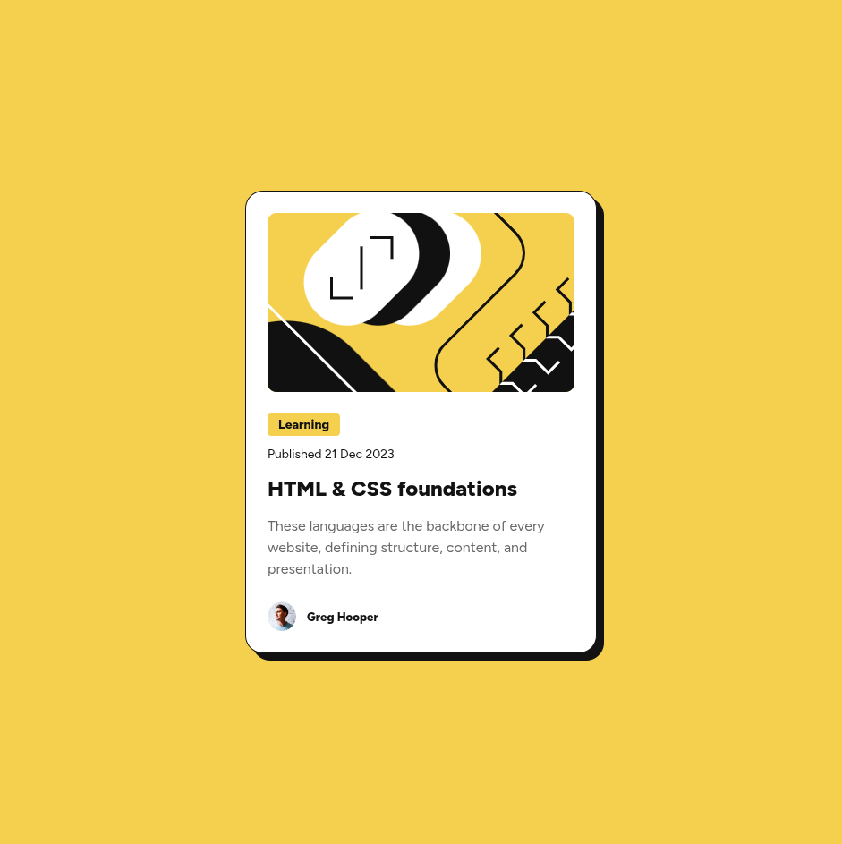
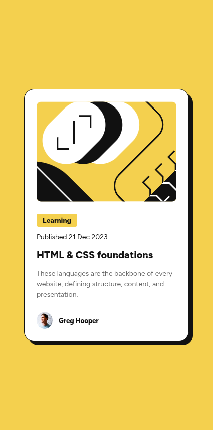

# Frontend Mentor - Blog preview card solution

This is a solution to the [Blog preview card challenge on Frontend Mentor](https://www.frontendmentor.io/challenges/blog-preview-card-ckPaj01IcS). Frontend Mentor challenges help you improve your coding skills by building realistic projects. 

## Table of contents

- [Overview](#overview)
  - [The challenge](#the-challenge)
  - [Screenshot](#screenshot)
  - [Links](#links)
- [My process](#my-process)
  - [Built with](#built-with)
  - [What I learned](#what-i-learned)
  - [Continued development](#continued-development)
- [Author](#author)
- [Acknowledgments](#acknowledgments)

**Note: Delete this note and update the table of contents based on what sections you keep.**

## Overview

### The challenge

Users should be able to:

- See hover and focus states for all interactive elements on the page

### Screenshot

#### Desktop Screenshot



#### Mobile Screenshot



### Links

- Solution URL: [Add solution URL here](https://your-solution-url.com)
- Live Site URL: [Add live site URL here](https://your-live-site-url.com)

## My process

### Built with

- Semantic HTML5 markup
- CSS custom properties
- Flexbox
- CSS Grid
- Mobile-first workflow

### What I learned

I learnt to use the **range syntax** as a more intuitve and straight-forward syntax than media queries, compared to the less intuitive logical of **min-width** and **max-width**. I use this together with **nested styles** which was to me like a syntactic sugar:

```css
#card_image_wrapper {
 width: 17.4375rem;

 @media (width > 460px) {
    width: 21.4375rem;
 }
}
```

### Continued development

I would like to extend my current styling skillset the include more responsiveness, especially the use of **min()** and **clamp()**


## Author

- Frontend Mentor - [@maikel-mattiu](https://www.frontendmentor.io/profile/maikel-mattiu)
- Twitter - [@mich_nduka](https://x.com/mich_nduka)


## Acknowledgments

Thank you Frontend Mentor for a wonderful platform to practice and develop my frontend skills.

